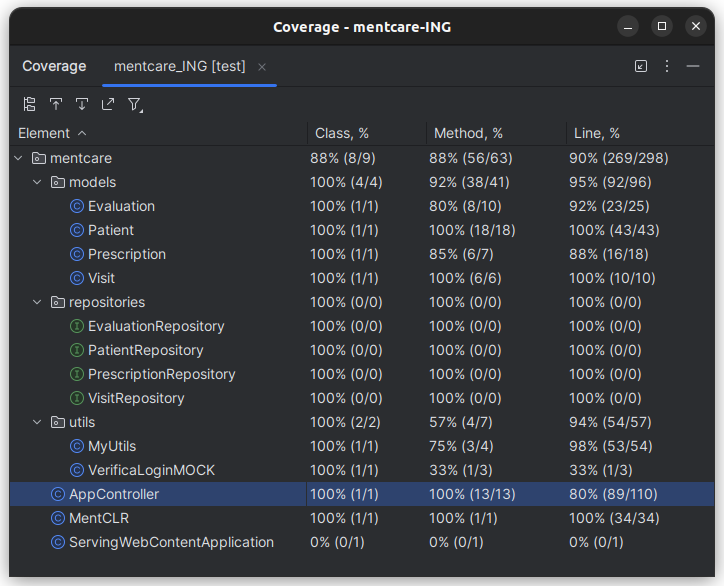

# Mental Care

## Authors
- Alessandro Pallotta **VR501256**
- Mathias Dalla Palma **VR504159**

## Project

MentCare è un'app pensata per rendere più semplici e efficienti le operazioni di amministrazione all'interno di una clinica medica come ad esempio la gestione delle informazioni dei pazienti, delle loro valutazioni e prescrizioni e la consultazione di alcune informazioni statistiche sui dati del sistema.

## Requisiti

### Scenarios:
 	 	 	
### 1. LOGIN
|   |                                                                                                                                                                                                                                                                                                                                       |
|---|---------------------------------------------------------------------------------------------------------------------------------------------------------------------------------------------------------------------------------------------------------------------------------------------------------------------------------------|
| **Assumptions** | Un utente si trova sulla pagina di login e vuole autenticarsi sulla piattaforma MentCare attraverso le credenziali fornite al momento dell’iscrizione. L’utente dovrebbe possedere tali credenziali e dovrebbero coincidere con quelle presenti nei registri di sistema della piattaforma in modo da garantire l’accesso appropriato. |
|**Flow**| L’utente inserisce nel form di login l'username e la password nei rispettivi campi e clicca sul bottone di login. Il sistema verifica che le credenziali siano corrette e se lo sono autentica la sessione e reindirizza la navigazione alla pagina home della piattaforma.                                                           |
|**GUI objects**| • form di login • bottone "login"                                                                                                                                                                                                                                                                                                  |
|**Errors**| Se l’utente ha inserito delle credenziali errate la pagina mostra un messaggio di errore e i campi del form vengono resettati.                                                                                                                                                                                                        |
|**Altre attività**| Un utente che non riesce ad accedere alla piattaforma può fare richiesta di nuove credenziali attraverso la procedura di recupero credenziali.                                                                                                                                                                                        |
|**Sysytem status**| La connessione è stata autenticata e l’utente è stato reindirizzato alla pagina home della piattaforma.                                                                                                                                                                                                                               

### 2. VISUALIZZAZIONE DETTAGLI PAZIENTE
| |                                                                                                                                                                                                                                                                                                                                             |
|-|---------------------------------------------------------------------------------------------------------------------------------------------------------------------------------------------------------------------------------------------------------------------------------------------------------------------------------------------|
|**Assumptions**| Un utente autenticato vuole visualizzare nel dettaglio i dati relativi ad uno specifico paziente che sono stati precedentemente registrati nel sistema.                                                                    |
|**Flow**| • L’utente, a partire dalla home, ha cliccato sulla riga relativa al paziente che vuole visualizzare nel dettaglio, a questo punto il sistema reindirizza la navigazione alla pagina desiderata. • L’utente ha digitato il link “MentCare.com/patient/{id_paziente}” e il sistema ha reindirizzato la navigazione alla pagina desiderata. |
|**GUI objects**| • Sezione per i dettagli paziente  • Sezione dettagli medici                                                                                                                                                                                                                                                                             
|**Errors**| L’id_paziente digitato nel link non è associato ad alcun paziente catalogato nel sistema, quindi la piattaforma mostra un messaggio di errore che avvisa l’utente che l’id non è corretto.                                                                                                                                                  |
|**Sysytem status**| La pagina mostra i dati dettagliati dello specifico paziente. Alcuni dei dati mostrati sono: informazioni anagrafiche, di contatto, esito delle visite e medicine assegnate al paziente.                                                                                                                                                    |

### 3. REPORT TOTALE PAZIENTI
| |                                                                                                                                                                                                                                                                            |
|-|----------------------------------------------------------------------------------------------------------------------------------------------------------------------------------------------------------------------------------------------------------------------------|
|**Assumptions**| Un utente autenticato vuole scaricare statistiche basate sui dati dei pazienti salvati nel sistema. L’utente si trova nella pagina home della piattaforma.                                                                                                                 |
|**Flow**| L’utente clicca sull'apposito bottone “report”, il sistema avvia il download del file.|                                                                                                                                                                                      
|**GUI objects**| • bottone report                                                                                                                                                                                                                                                           |
|**Errors**| Il sistema potrebbe trovarsi in uno stato in cui non è possibile generare un report per esempio se nessun paziente è stato ancora registrato. In questo caso la pagina mostra un messaggio di errore.                                                                      |
|**Sysytem status**| Nel sistema viene aggiunta una voce ai log e viene creato il file report richiesto, successivamente viene scaricato sul dispositivo dell’utente che ha avviato la funzione. Con esito negativo viene mostrata una schermata di errore con i vari dettagli.|

### 4. AGGIUNTA VALUTAZIONE PAZIENTE
| |                                                                                                                                                                                                                                                                                                                                                                                                               |
|-|---------------------------------------------------------------------------------------------------------------------------------------------------------------------------------------------------------------------------------------------------------------------------------------------------------------------------------------------------------------------------------------------------------------|
|**Assumptions**| Un utente autenticato vuole aggiungere una valutazione ad uno specifico paziente. L’utente si trova sulla pagina dei dettagli del paziente.                                                                                                                                                                                                                                                                   |
|**Flow**| L'utente clicca sul pulsante aggiungi valutazione e la navigazione viene reindirizzata alla pagina di aggiunta valutazione. L’utente inserisce nel form di valutazione i dati relativi alla visvalutazioneita (data, motivo, esito, note) nei rispettivi campi e clicca sul bottone di conferma. Il sistema verifica che i dati siano consistenti e se lo sono li salva associandoli allo specifico paziente. |
|**GUI objects**| • bottone “aggiungi”   • pagina dedicata alla registrazione di una nuova valutazione: • form dati  • bottoni "accetta" e "annulla"                                                                                                                                                                                                                                                                   |
|**Errors**| I dati inseriti potrebbero contenere degli errori per esempio la quantità inserita è troppo alta o negativa.                                                                                                                                                                                                                                                                                                  |
|**Sysytem status**| I dati inseriti vengono salvati nel sistema e sono visualizzabili come prima voce nella sezione Valutazioni. Con esito negativo viene visualizzata una schermata di errore.                                                                                                                                                                                                                                   |

### 5. REPORT PAZIENTE
| | |
|-|-|
|**Assumptions**| Un utente autenticato vuole scaricare un file report contenente le informazioni di uno specifico paziente. L’utente si trova nella pagina di dettaglio del paziente.
|**Flow**| L'utente clicca sul bottone "report" e viene avviatio il download del file di report contenente varie informazioni e alcune statistiche legate al paziente.
|**GUI objects**|• bottone report|
|**Errors**| L'utente dottore potrebbe chiudere la finestra prima che il file venga generato, annullando l'operazione anche se il file sarà comunque generato in backend.|
|**Sysytem status**| Nel sistema viene aggiunta una voce ai log e viene creato il file report richiesto, successivamente viene scaricato sul dispositivo dell’utente che ha avviato la funzione. Con esito negativo viene mostrata una schermata di errore con i vari dettagli.|

### 6. AGGIUNTA PRESCRIZIONE PAZIENTE
| |                                                                                                                                                                                                                                                                                                                                                                                                    |
|-|----------------------------------------------------------------------------------------------------------------------------------------------------------------------------------------------------------------------------------------------------------------------------------------------------------------------------------------------------------------------------------------------------|
|**Assumptions**| Un utente autenticato vuole aggiungere una prescrizione a un certo paziente                                                                                                                                                                                                                                                                                                                        |
|**Flow**| L'utente tramite la pagina del paziente utilizza il bottone “aggiungi prescrizione”, il sistema  reindirizza la navigazione alla pagina di inserimento. L'utente tramite il form può aggiungere un nuovo medicinale, la sua quantità e una nota riguardo come assumere il medicinale e quali trattamenti seguire. Tramite bottoni i "accetta" e "annulla" può confermare o annullare l'operazione. |
|**GUI objects**| • bottone “Aggiungi” nella sezione prescrizione medica   • pagina dedicata: • identificativo paziente • form per la nuova prescrizione • bottoni accetta o annulla                                                                                                                                                                                                                        |
|**Errors**| I dati inseriti potrebbero contenere degli errori per esempio: i medicinali inseriti non sono compatibili con il paziente oppure la quantità di medicinali non è corretta. In ogni caso viene mostrata una finestra con un messaggio dell’errore specifico e l’utente dovrà correggere il testo inserito.                                                                                          |
|**Other**| Altri utenti legati al paziente a cui è stata effettuata la modifica ricevono una email di notifica, essa contiene l'utente che ha effettuato il cambiamento, un'identificazione del paziente, il testo e data+ora.                                                                                                                                                                                |
|**Sysytem status**| Il sistema registra l'evento di aggiunta, genera e invia le info dell'evento agli utenti legati al paziente. Infine il sistema reindirizza la navigazione alla pagina del paziente, in cui  può verificare l'avvenuta aggiunta. Nel caso di valori non inseriti o errati, viene mostrata una schermata di errore                                                                                   |

### 7. AGGIUNTA PAZIENTE
| |                                                                                                                                                                                                                                                                                                                                                                                                                                       |
|-|---------------------------------------------------------------------------------------------------------------------------------------------------------------------------------------------------------------------------------------------------------------------------------------------------------------------------------------------------------------------------------------------------------------------------------------|
|**Assumptions**| Un utente autenticato vuole aggiungere un nuovo paziente al sistema. L'utente si trova nella pagina home.                                                                                                                                                                                                                                                                                                                             |
|**Flow**| L'utente utilizza l'apposito bottone nella home "aggiungi paziente" e viene reindirizzato dal sistema in una pagina dedicata alla creazione di un nuovo profilo paziente. L'utente inserisce i dati anagrafici e informazioni di contatto del nuovo paziente nell'apposito form, inoltre deve inserire le allergie o farmaci che non può assumere. Infine l’utente deve confermare o annullare l'operazione tramite appositi bottoni. |
|**GUI objects**| • bottone “aggiungi paziente”    • pagina dedicata alla registrazione di un nuovo utente paziente nel sistema:  • form dati anagrafici • bottoni "accetta" e "annulla"                                                                                                                                                                                                                                                       |
|**Errors**| L'utente potrebbe provare a creare più profili dello stesso paziente, tramite il codice fiscale il sistema assicura che non accada.                                                                                                                                                                                                                                                                                                   |
|**Sysytem status**| Nel caso di inserimento andato a buon fine il nuovo utente viene aggiunto al sistema e l’utente viene reindirizzato alla pagina home. Con esito negativo la pagina mostra un errore specifico.                                                                                                                                                                                                                                        |

## Sviluppo
Per la scelta degli scenari abbiamo immaginato situazioni legate a diverse situazioni di utilizzo, in modo da avere un’applicazione utilizzabile una volta completata. Nel dettaglio abbiamo costruito gli scenari rispetto al punto di vista di un utente con il ruolo di dottore, ipotizzando come avrebbe potuto utilizzare la nostra applicazione in un contesto reale; per semplicità nei vari documenti è chiamato solo utente. 
#### Componenti implementati:
Seguendo gli scenari abbiamo implementato le pagine necessarie per effettuare le varie funzionalità:
- `/login` - per autenticare l’utente; invece di un vero sistema di autenticazione abbiamo simulato il login con un MOCK, **le credenziali per l’accesso alla pagina home sono admin, admin**.
- `/home` - pagina per la visualizzazione dei pazienti e delle visite, questa è la pagina principali da cui l’utente può usufruire delle varie funzionalità espresse nei vari scenari. 
- `/patient/{id}` - corrisponde alla pagina di visualizzazione del singolo paziente, qui sono presenti i dati anagrafici e di contatto, le tabelle contenenti le sue valutazioni e le sue prescrizioni, inoltre da questa pagina è possibile spostarsi nelle pagine di report, inserimento prescrizione e inserimento valutazione.
- `/patient/{id}/addPrescription` - è la pagina utilizzata per aggiungere una prescrizione al paziente
- `/patient/{id}/addEvaluation` - è la pagina utilizzata per aggiungere una valutazione al paziente
- `/patient/{id}/report` - questa pagina simula la creazione e download di un file di report che comprende un riassunto dei dati del paziente. La pagina mostra un report con varie statistiche basate sui dati effettivamente presenti nel sistema.
- `/report` - questa pagina simula la creazione e download del file di report generale, la pagina genera effettivamente un report con varie statistiche basate sui dati effettivamente presenti nel sistema.
- `/error` - la pagina di errore viene generata dalle altre pagine e in base all’errore gli viene fornito un titolo, un messaggio e un link per tornare indietro.

#### Processo di sviluppo  
Per il progetto ci siamo ispirati a due tecniche di implementazione viste a lezione: una volta definiti gli scenari abbiamo deciso di seguire una progettazione **test-driven** (scrivendo prima i casi di test e successivamente implementando i componenti per soddisfarli) e un **processo di sviluppo agile** cercando man mano di implementare funzionalità complete e che potessero essere utilizzate da un utente finale. Non abbiamo fissato delle vere e proprie tempistiche per gli sprint data la semplicità del progetto e abbiamo effettuato l’implementazione in base alla priorità di utilizzo dei vari componenti. 

Dato che l’approccio ai test è tramite PageObjects: come prima cosa abbiamo valutato i possibili oggetti da inserire nelle pagine per avere un’immagine più chiara di quello che sarebbe servito (questi sono presenti nella sezione degli scenari). Fatto ciò, abbiamo iniziato ad implementare i vari PageObject, anche se non erano definitivi sono stati utili per concretizzare al meglio alcuni dettagli ancor prima di iniziare la vera e propria scrittura dei test. Abbiamo infine codificato il possibile comportamento dell’utente attraverso le azioni che potrebbe svolgere all’interno dell’applicazione e scritto le asserzioni che rispecchiassero i vari risultati attesi.

Una volta completata la scrittura dei test siamo passati all’implementazione dei vari componenti: abbiamo iniziato dall’implementazione delle pagine più importanti, in modo da essere sicuri di avere i collegamnti necessari per le pagine secondarie.

Completati i componenti principali siamo passati ad implementare componenti con una priorità più bassa come i report e le pagine di errore. Inizialmente la pagina di errore era stata immaginata più semplice di quella che è stata sviluppata, di conseguenza abbiamo dovuto correggere i test per aggiungere i dettagli degli errori e i metodi per la generazione dei messaggi di errore che sono presenti nelle classi model (selfCheck()).\
Infine siamo passati a una fase di debugging correggendo errori delle pagine html, errori di visualizzazione e alcuni test che non erano allineati all’implementazione, infine abbiamo testato il sistema nella sua interezza.

#### Approccio di branching

In questa fase abbiamo utilizzato i branch git in modo da dividere meglio il carico di lavoro per vari elementi in sviluppo, la politica che abbiamo scelto è stata: costruirne un branch per ogni funzionalità dell’applicazione.\
Inoltre, prima di cambiare branch abbiamo eseguito i test per assicurarci che l’implementazione fosse completa e corretta. L’utilizzo dei branch ci ha permesso di lavorare su funzionalità diverse simultaneamente senza interferire l'uno con l'altro.

## Testing e coverage

Per la **test selection** ci siamo basati sui **flow** specificati negli scenari e sugli **errors** degli stessi. L'obiettivo principale era assicurare che l'applicazione si comportasse correttamente e in modo affidabile a diverse condizioni operative sia con esito positivo che negativo. In questo modo abbiamo raggiunto una buona **test-coverage** del progetto:

Oltre a questi test principali, avevamo previsto dei test specifici sui componenti più piccoli (unit test), ma queste funzionalità sono già coperte dai test di accettazione delle pagine. Di conseguenza ci è sembrato superfluo creare ulteriori test specifici, anche perché lo stato dell’applicazione rispettava appieno i requisiti dettati dagli scenari.